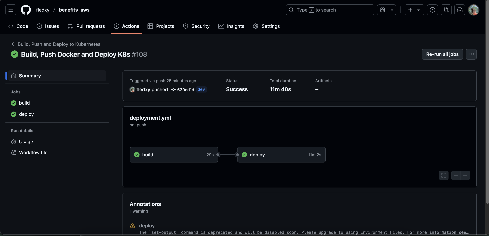
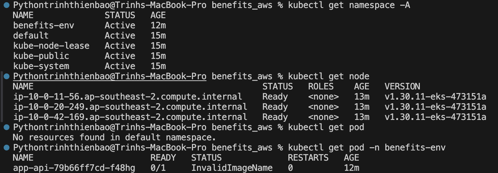

# Benefits_aws

**GIT REPO**

The repository has two branches: dev and main.

**CICD PIPELINE**
the cicd pipeline

build: will processed step build docker image to private repo in my dockerhub

deploy: will update the manifest to deploy the eks cluster

**EKS DEPLOYMENT**

all environment is deployment to eks
# benefits_demo
